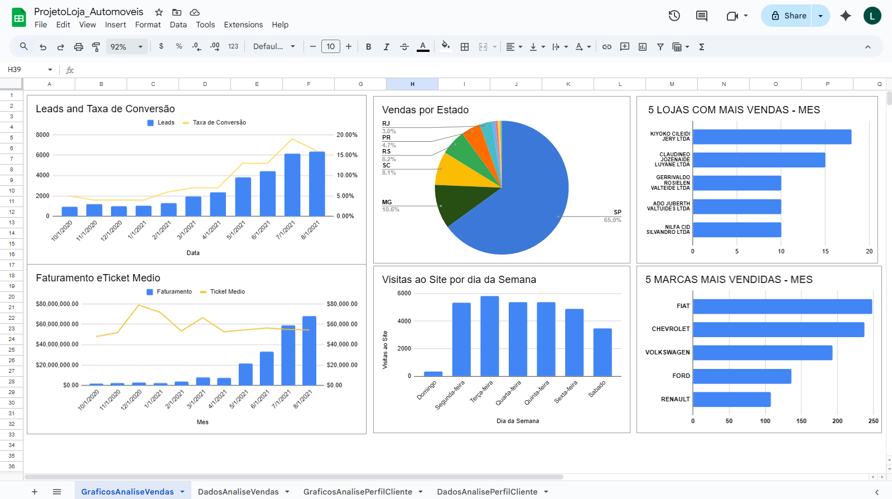

# Estudo de Caso: Análise de Vendas, Produtos e Perfil de Clientes de uma Franquia de Lojas de Automóveis

Este repositório apresenta um **estudo de caso de análise de dados de vendas e perfil de clientes** de uma franquia de lojas de automóveis.  
O objetivo é **identificar oportunidades estratégicas de investimento**, incluindo **estados com maior potencial de crescimento**, **produtos mais rentáveis** e **melhores dias e horários para veiculação de anúncios**, com base em dados históricos de vendas e comportamento dos clientes.

---

## 1. Objetivo

Identificar e lapidar a **persona dos clientes**, compreendendo de forma aprofundada **quais perfis, regiões e produtos apresentam melhor desempenho comercial**.

A análise se concentra nos seguintes pontos:

- **Faixa salarial e status profissional dos clientes**
- **Top 5 marcas mais vendidas no mês**, incluindo **faturamento total** e **ticket médio mensal**
- **Leads gerados e taxa de conversão**

Com base nos **padrões de vendas das lojas** e nos **dados comportamentais dos usuários**, o estudo busca gerar **insights estratégicos** para decisões de marketing, expansão e alocação de investimentos.

---

## 2. Dataset

O dataset foi obtido a partir de uma **fonte pública no Kaggle**, simulando dados reais do setor automotivo.

Principais conjuntos de dados:

- Dados de clientes (perfil socioeconômico e profissional)
- Dados de vendas (marca, valor, data, loja e estado)
- Dados de leads e conversões
- Dados de acesso e interação com campanhas digitais

**Formatos:** `.csv`

---

## 3. Métricas Analisadas

As principais métricas analisadas foram:

- `TotalVendas` — número total de vendas realizadas  
- `FaturamentoTotal` — soma do valor das vendas  
- `TicketMedio` — faturamento total dividido pelo número de vendas  
- `Faixa Salarial` — faixa salarial dos clientes
- `TaxaConversao` — vendas realizadas / leads gerados  
- `VendasPorMarca` — desempenho por fabricante  
- `VendasPorEstado` — desempenho geográfico
- `Faixa Etária` — faixa etárial dos clientes
- `Status Profissional` — status profissional dos clientes
  

---

## 4. ETL com PostgreSQL

O processo de **ETL (Extract, Transform, Load)** foi realizado integralmente em **PostgreSQL**, utilizando o banco de dados como camada central de transformação e consolidação dos dados analíticos.

Os dados foram **extraídos** a partir de arquivos `.csv`, **transformados** por meio de consultas SQL (tratamento, normalização e criação de métricas) e, por fim, **carregados** em tabelas analíticas prontas para consumo em visualizações e análises exploratórias.

### Etapas do ETL

- **Extração**
  - Importação dos dados brutos a partir de arquivos `.csv` utilizando o comando `COPY`.

- **Transformação**
  - Padronização de tipos de dados e formatos de data (`CAST`, `EXTRACT`)
  - Cálculo de valores financeiros considerando descontos aplicados
  - Criação de atributos temporais (mês e ano)
  - Geração de métricas analíticas como:
    - `ticket_medio`
    - `faturamento`
  - Tratamento de registros inválidos (remoção de vendas sem data de pagamento)

- **Carga**
  - Consolidação dos dados transformados em tabelas analíticas agregadas
  - Organização por período (mês e ano) para análises temporais

### Exemplo de Query de Transformação

```sql
WITH tabelarest AS (
    SELECT
        t1.product_id,
        t1.customer_id,
        (t2.price + (t2.price * t1.discount)) AS valor_real,
        EXTRACT(MONTH FROM paid_date) AS mes,
        EXTRACT(YEAR FROM paid_date) AS ano
    FROM sales.funnel AS t1
    LEFT JOIN sales.products AS t2
        ON t1.product_id = t2.product_id
    WHERE paid_date IS NOT NULL
    ORDER BY paid_date
)
SELECT
    ROUND(SUM(valor_real) / COUNT(DISTINCT customer_id), 2) AS ticket_medio,
    SUM(valor_real) AS faturamento,
    mes,
    ano
FROM tabelarest
GROUP BY
    ano,
    mes;

````
## 5. Principais Insights

Com base na análise dos dados de **vendas, leads e comportamento dos clientes**, foram identificados os seguintes padrões estratégicos para campanhas de marketing e veiculação de anúncios:

| Tipo de Campanha            | Melhor Dia           | Melhor Horário |
|-----------------------------|----------------------|----------------|
| Anúncios Promocionais       | Sexta e Sábado       | 18:00 – 21:00 |
| Conteúdo Institucional      | Segunda e Terça      | 16:00 – 19:00 |
| Campanhas de Conversão      | Domingo              | 17:00 – 20:00 |

### Observações

- **Sexta e sábado** concentram maior volume de acessos e interações, sendo ideais para **anúncios promocionais de curto impacto**.  
- **Segunda e terça-feira** apresentam melhor desempenho para **conteúdo institucional e informativo**, quando os usuários demonstram maior atenção.  
- **Domingo** registra a **maior taxa de conversão**, indicando um momento favorável para campanhas focadas em fechamento de vendas.  
- Os horários de maior engajamento geral ocorrem entre **16h e 21h**, tornando esse intervalo o mais eficiente para **veiculação de anúncios**.

---

## 6. Problemas Encontrados e Soluções

Durante o processo de **ETL, modelagem analítica e análise de dados em PostgreSQL**, foram identificados alguns desafios técnicos relevantes, descritos a seguir.

### 1. Registros sem data de pagamento

- **Problema:** Parte dos registros não possuía `paid_date`, inviabilizando análises de faturamento, ticket médio e conversão.
- **Solução:** Aplicação do filtro `WHERE paid_date IS NOT NULL` em todas as consultas analíticas, garantindo que apenas vendas concluídas fossem consideradas.

---

### 2. Risco de duplicidade após junções entre tabelas

- **Problema:** As junções entre tabelas de vendas, produtos, clientes e lojas poderiam gerar contagens incorretas.
- **Solução:** Uso de agregações controladas em CTEs e aplicação de `COUNT(DISTINCT ...)` para métricas sensíveis, como clientes e leads.

---

### 3. Cálculo correto de métricas financeiras

- **Problema:** O valor real da venda dependia da aplicação correta dos descontos sobre o preço do produto.
- **Solução:** Criação do campo calculado `valor_real`, centralizando o cálculo nas CTEs para reutilização nas métricas de faturamento e ticket médio.

---

### 4. Padronização temporal para análises mensais

- **Problema:** Os dados estavam em nível diário, mas as análises exigiam consolidação por mês e ano.
- **Solução:** Extração de `mes` e `ano` com `EXTRACT()` e posterior agrupamento para geração de métricas mensais.

---

### 5. Normalização e categorização do perfil dos clientes

- **Problema:** Informações de perfil (gênero, faixa salarial, faixa etária e status profissional) não estavam padronizadas.
- **Solução:** Uso de expressões `CASE WHEN` para criar categorias analíticas consistentes e comparáveis.

---

### Resultado Final

A aplicação dessas soluções garantiu:

- **Qualidade e consistência dos dados**
- **Métricas confiáveis para geração de gráficos**
- **Base analítica sólida para tomada de decisão**
- **Reprodutibilidade das análises via SQL puro**

Todo o pipeline analítico foi executado exclusivamente em **PostgreSQL**, reforçando o domínio em **SQL, ETL e análise de dados**.

---

## 7. Dashboard

Os resultados finais foram consolidados em um **dashboard analítico**, permitindo a visualização clara dos principais indicadores de desempenho, como:

- Faturamento por estado e marca  
- Ticket médio por perfil de cliente  
- Dias com maior acesso de Leads
- Gênero, Faixa Etária e Faixa Salarial dos clientes

#Análise de Vendas e Marketing



#Análise de Perfil de Clientes e Produtos 


