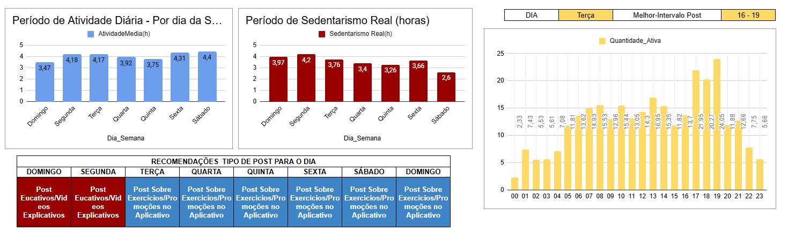

# Estudo de Caso: Análise de Aplicativo e Relógio ligado a Atividade Física e Sono a fim de Compreender os Melhores horários para Cada tipo de Posts

Este repositório contém o estudo de caso de análise de dados de usuários de dispositivos **wearables**, com o objetivo de identificar os melhores dias e horários para publicar diferentes tipos de conteúdo com base nos padrões de atividade física e sono.

---

## 1. Objetivo

Identificar os melhores dias e horários para publicar conteúdo:
- **Posts rápidos / Stories**
- **Posts longos / Carrossel**
- **Vídeos (Reels / Shorts)**

Baseado nos padrões de atividade e sono dos usuários.

---

## 2. Dataset

O dataset foi obtido de uma fonte pública no [Kaggle](https://www.kaggle.com/), contendo:

- Minutos de atividade intensa, moderada e leve
- Minutos sedentários
- Minutos de sono

**Formatos:** `.csv` e `.txt`

---

## 3. Métricas Analisadas

- `VeryActiveMinutes` — minutos de atividade intensa  
- `FairlyActiveMinutes` — minutos de atividade moderada  
- `LightlyActiveMinutes` — minutos de atividade leve  
- `SedentaryMinutes` — minutos sedentários  
- `TotalMinutesAsleep` — minutos de sono  

---

## 4. ETL e BigQuery

As tabelas foram criadas no **Google BigQuery**, incluindo tratamento de dados e transformações:

- Padronização de datas (`DATE()`, `CAST`)  
- Criação de variáveis derivadas:
  - `TempoAtividadeTotal` = soma das atividades  
  - `SedentarioAcordado` = sedentarismo subtraído do sono  
- Junção entre tabelas de atividade e sono  

Exemplo de query:

```sql
CREATE OR REPLACE TABLE `StudyCase.AtividadeDiaria` AS
SELECT CAST(Id AS STRING) AS Id,
       ActivityDate,
       VeryActiveMinutes,
       LightlyActiveMinutes,
       FairlyActiveMinutes,
       SedentaryMinutes
FROM `StudyCase.AtividadeDiaria`;
````
## 5. Principais Insights

Com base na análise dos dados de atividade física e sono, os principais insights foram:

| Tipo de Conteúdo          | Melhor Dia           | Melhor Horário  |
|---------------------------|-------------------|----------------|
| Post Rápido / Story       | Sábado e Domingo  | 18:00 - 20:00  |
| Post Longo / Carrossel    | Domingo e Segunda | 16:00 - 19:00  |
| Vídeo (Reels / Shorts)    | Domingo           | 16:00 - 19:00  |

**Observações:**
- Sábado e Domingo apresentam maior atividade intensa dos usuários, ideal para posts rápidos.  
- Domingo e Segunda são melhores para conteúdo mais longo e vídeos, aproveitando o menor sedentarismo no período da tarde.  
- Os horários de maior atividade geral ficam entre **16h e 20h**, sendo ideais para publicações.  

---

## 6. Problemas Encontrados e Soluções

Durante o processo de ETL e análise, os seguintes problemas foram identificados:

1. **Inconsistência de formatos de data**
   - Solução: padronização com funções de data no BigQuery (`DATE()`, `CAST`) e ajustes em planilhas quando necessário.

2. **Duplicatas após JOIN**
   - Solução: remoção via deduplicação em BigQuery e ferramentas de limpeza.

3. **Registros com campos primários ausentes (Id ou Data)**
   - Solução: exclusão desses registros, pois não eram confiáveis para análise.

Essas ações garantiram a **qualidade e consistência dos dados** para os insights finais.



